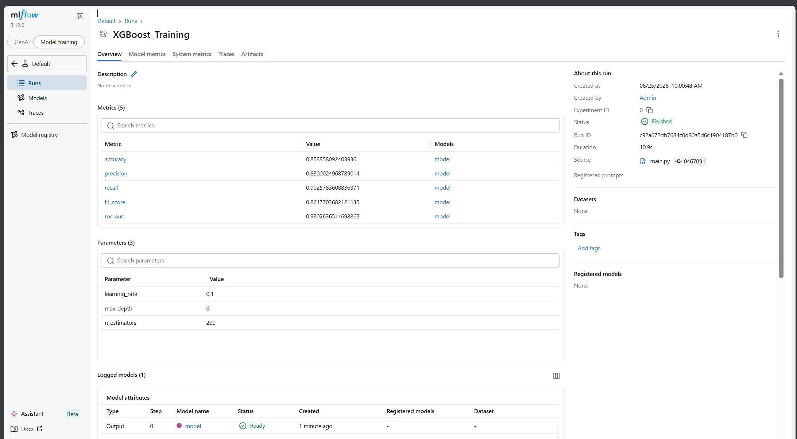
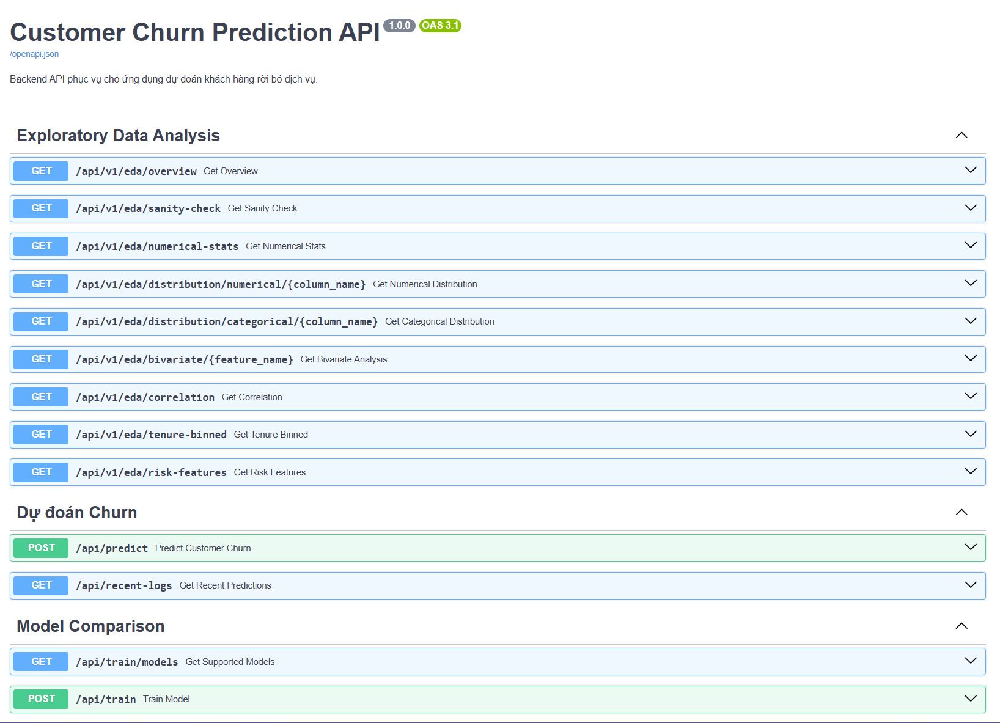
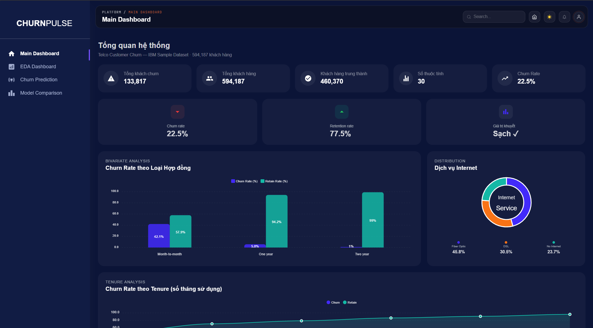
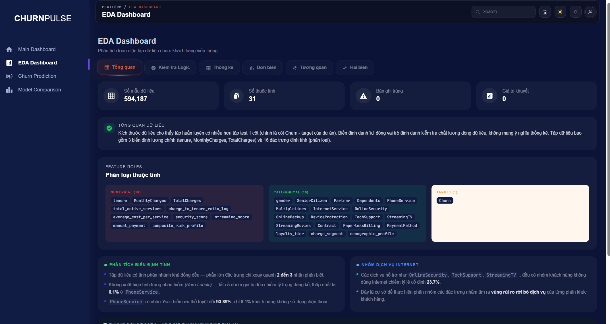
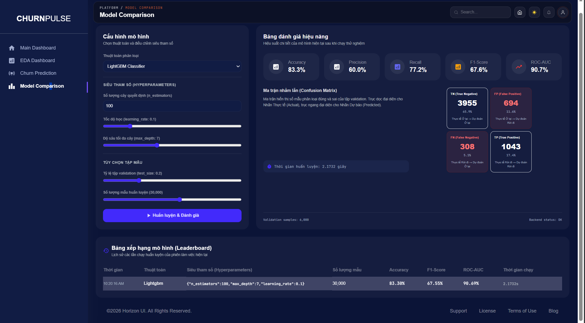
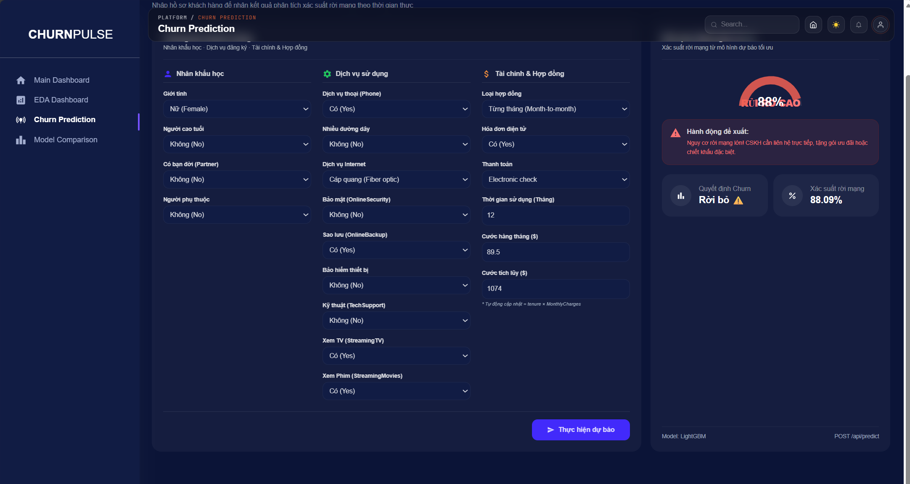

# 1. Tổng quan dự án
Mini Project của nhóm 14, phục vụ cho học phần nhập môn khoa học dữ liệu. Dự án gồm:
- EDA để khám phá bộ dữ liệu từ Kaggle: https://www.kaggle.com/competitions/playground-series-s6e3/data
- Feature Engineering để tạo các đặc trưng cho mô hình phân loại
- Tạo và huấn luyện các mô hình phân loại dựa trên kiến trúc MLflow
- Trực quan hoá kết quả và thêm các tính năng tương tác qua web interface

# 2. Cấu trúc dự án
```
customer_churn_prediction/
├── config/                          # Các file cấu hình
│   ├── config.yaml                  # Cấu hình đường dẫn cho từng stage
│   ├── schema.yaml                  # Định nghĩa schema của dữ liệu
│   ├── logging.yaml                 # Cấu hình logging
│   └── params.yaml                  # Hyperparameters cho model training
│
├── src/                             # Source code chính
│   ├── components/                  # Các component xử lý logic
│   ├── config/                      # Configuration management
│   ├── entity/                      # Data entities (dataclasses)
│   ├── pipeline/                    # Pipeline wrappers cho từng stage
│   └── utils/                       # Utility functions
│
├── data/                            # Dữ liệu thô (zip files)
├── artifacts/                       # Outputs từ các stages
├── logs/                            # Log files
├── mlruns/                          # MLflow tracking data
├── EDA/                             # Exploratory Data Analysis notebooks
│
├── main.py                          # Entry point - chạy toàn bộ pipeline
├── requirements.txt                 # Python dependencies
└── README.md                        # Documentation (file này)
```
Chi tiết hơn về kiến trúc MLflow: https://github.com/Ducdata1808/customer_churn_prediction/blob/main/src/README.md

# 3. Hướng dẫn sử dụng

## 3.1 Cài đặt môi trường

```bash
# Clone repository
git clone <repository-url>
cd customer_churn_prediction

# Tạo virtual environment
python -m venv venv

# Activate virtual environment
# Windows:
venv\Scripts\activate
# Linux/Mac:
source venv/bin/activate

# Cài đặt dependencies
pip install -r requirements.txt
```

## 3.2 Chuẩn bị dữ liệu

Đặt file `playground-series-s6e3.zip` vào thư mục `data/`:

```
data/
└── playground-series-s6e3.zip
```

## 3.3 Chạy toàn bộ pipeline

```bash
python main.py
```
Xem kết quả trong MLflow

```bash
mlflow ui
```

Truy cập: http://localhost:5000

Trong MLflow UI bạn sẽ thấy:

- **Experiments**: Các lần chạy training
- **Runs**: LightGBM_Training, XGBoost_Training, Model_Evaluation
- **Metrics**: ROC AUC, F1-Score, Accuracy, Precision, Recall
- **Parameters**: Hyperparameters của từng mô hình
- **Artifacts**: Models, Confusion Matrix, ROC Curve




## 3.4 Chạy từng stage riêng lẻ (để debug)

```bash
# Stage 1: Data Ingestion
python src/pipeline/stage_01_data_ingestion.py

# Stage 2: Data Validation
python src/pipeline/stage_02_data_validation.py

# Stage 3: Data Transformation
python src/pipeline/stage_03_data_transformation.py

# Stage 4: Model Training
python src/pipeline/stage_04_model_trainer.py

# Stage 5: Model Evaluation
python src/pipeline/stage_05_model_evaluation.py

# Stage 6: Prediction & Submission
python src/pipeline/stage_06_prediction.py

# Hoặc có thể chạy nhanh script prediction độc lập:
python predict.py
```

---

# 4. Khởi chạy Backend API (FastAPI)
Sau khi đã có mô hình trong thư mục `artifacts/`, bạn có thể khởi chạy API server.

- Đảm bảo bạn đang ở thư mục gốc của dự án và môi trường ảo Python đã được kích hoạt.
- Chạy lệnh sau để khởi động server trên cổng **`8002`** (đây là cổng mặc định mà Frontend sẽ gọi):
   ```bash
   cd backend
   uvicorn app.main:app --reload --host 0.0.0.0 --port 8002
   ```
- Kiểm tra hoạt động:
   * Truy cập `http://localhost:8002/` trên trình duyệt để kiểm tra trạng thái API (nếu hiển thị `{"status": "ok", ...}` là thành công).
   * Xem tài liệu API tương tác (Swagger UI) tại: `http://localhost:8002/docs`.*



Chi tiết về Backend: https://github.com/Ducdata1808/customer_churn_prediction/tree/main/backend

---

# 5. Khởi chạy Giao diện Frontend (React)
Frontend được xây dựng bằng React và kết nối trực tiếp với Backend cục bộ thông qua cổng `8002`.

## 5.1 Di chuyển vào thư mục frontend & Cài đặt Node modules
Yêu cầu máy tính đã cài đặt **Node.js** (Khuyên dùng phiên bản LTS v18 trở lên).
```bash
# Di chuyển vào thư mục frontend
cd frontend

# Cài đặt các dependencies (sử dụng --legacy-peer-deps để tránh xung đột phiên bản React 19)
npm install --legacy-peer-deps
```

## 5.2 Cấu hình biến môi trường
File cấu hình cục bộ `frontend/.env.local` đã được cấu hình sẵn để kết nối với backend chạy ở localhost:
- Linux
```env
REACT_APP_API_URL=http://localhost:8002
```
- Powershell
```env
$env:REACT_APP_API_URL="http://localhost:8002"
```
Nếu bạn chạy backend ở cổng khác, hãy chỉnh sửa giá trị này trong file `frontend/.env.local`.

## 5.3 Khởi chạy Frontend React
```bash
npm start
```
*   Ứng dụng sẽ tự động mở trên trình duyệt tại địa chỉ: **`http://localhost:3000`**
*   Giờ đây, bạn có thể thực hiện EDA, Huấn luyện mô hình từ giao diện, so sánh các tham số và chạy dự báo Churn trực quan hoàn toàn cục bộ!

Chi tiết về Fronted: https://github.com/Ducdata1808/customer_churn_prediction/tree/main/frontend

## 5.4 Một số hình ảnh giao diện ứng dụng

### Dashboard chính


### Phân tích khám phá dữ liệu (EDA)


### So sánh các mô hình huấn luyện


### Dự đoán tỷ lệ khách hàng rời bỏ (Churn Prediction)


